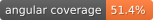

# 🥫 SecondServe

<p align="center">
  <!-- Technology Stack -->
  
  
  
  
  
  

  <!-- Code Quality -->
  
  

  <!-- Testing -->
  
  
  
  

  <!-- Documentation -->
  
  
  
  

  <!-- License -->
  
</p>


---

SecondServe is a full-stack platform built using **Angular**, **Django**, and **MongoDB**, designed as a student engineering project to manage food donations and deliveries efficiently between **organizations**, **drivers**, and **individual users**.  

The platform is containerized using **Docker Compose**, providing an easy-to-deploy development and production environment with automatic backend, frontend, and database orchestration.

---

## 📚 Table of Contents

1. [Overview](-🧩-Overvieww)
2. [Tech Stack](⚙️-tech-stack)
3. [Architecture](🏗️-architecture)
4. [Project Structure](🗂️-project-structure)
5. [Docker Setup](🐳-docker-setup)
6. [Environments](🌍-environments)
7. [Testing & Documentation](🔍-testing-&-documentation)
8. [Contributing](🤝-contributing)
9. [Future Enhancements](🧭-future-enhancements)
10. [License](🪪-license)

---

## 🧩 Overview

**SecondServe** connects donors, organizations, and delivery drivers to streamline the distribution of surplus food.  
It provides a real-time web interface for managing orders, deliveries, and donations through role-based access and dashboards.

**User Types:**
- 🧍 **User** – creates donation requests or posts food availability.  
- 🏢 **Organization** – manages incoming donations and monitors order history.  
- 🚚 **Driver** – accepts and completes delivery tasks assigned by organizations.

---

## ⚙️ Tech Stack

| Layer | Technology |
|:------|:------------|
| Frontend | Angular 20, TypeScript, TailwindCSS |
| Backend | Django 5 + Django REST Framework |
| Database | MongoDB (via `django-mongodb-backend`) |
| DevOps | Docker, Docker Compose, Nginx |
| Testing | Pytest (backend), Karma/Jasmine (frontend) |
| Documentation | Sphinx (backend), Compodoc (frontend) |

---

## 🏗️ Architecture

```text
+----------------------------------------------------+
|                      FRONTEND                      |
|            Angular (SSR / Dev / Nginx)             |
+------------------------|---------------------------+
                         |
                         | REST API
                         v
+----------------------------------------------------+
|                      BACKEND                       |
|                 Django + DRF                       |
|                 MongoDB Backend                    |
+------------------------|---------------------------+
                         |
                         | Mongoose Driver (ODM)
                         v
+----------------------------------------------------+
|                      DATABASE                      |
|                     MongoDB 7                      |
+----------------------------------------------------+
```
---
## 🗂️ Project Structure

```text
SecondServe/
│
├── backend/                  # Django backend
│   ├── Dockerfile
│   ├── requirements.txt
│   ├── manage.py
│   └── SecondServe/
│       ├── settings.py
│       ├── urls.py
│       └── wsgi.py
│
├── frontend/
│   ├── web/                  # Angular project source
│   ├── Dockerfile
│   ├── Dockerfile.dev
│   ├── nginx.conf
│   └── proxy.conf.json
│
├── docker-compose.yaml
├── .env
└── README.md
```
---
## 🐳 Docker Setup

The system runs with 4 main services, all defined in compose.yaml:
| Service | Description | Port |
|:------|:------------|:----|
| db | MongoDB instance | 27017 |
| backend | Django API server | 8000 |
| frontend | Angular build served via Nginx (production)| 80 |
| angular-dev | Angular live-reload dev server | 4200 |

### ✅ To start the stack
```bash
docker compose up --build
```

Once started
* 🌐 Frontend (Prod): http://localhost
* 🧪 Frontend (Dev): http://localhost:4200
* ⚙️ Backend API: http://localhost:8000
* 📦 MongoDB: mongodb://localhost:27017

By default the database generates the following users:
* Role: User
  * Emal: user@example.com
  * Password: user123
* Role: Organization
  * Emal: org@example.com
  * Password: org123
* Role: Driver
  * Emal: driver@example.com
  * Password: driver123

These default users can be edited or removed in ```./backend/MongoInit/management/commands/create_default_users.py```

---
## 🌍 Environments
All key environment variables are stored in .env:
```env
DJANGO_SECRET_KEY=your_secret_key
DEBUG=True
DJANGO_LOGLEVEL=info
DJANGO_ALLOWED_HOSTS=localhost,127.0.0.1,localhost:4200
DATABASE_NAME=dockerdjango
DATABASE_USERNAME=dbuser
DATABASE_PASSWORD=dbpassword
DATABASE_HOST=db
DATABASE_PORT=27017
MAPBOX_API_TOKEN=your_api_token
```

The Django secret key can be generated using the ```generateKey.py``` script found in the project's root directory.
---
## Usage
### Running the Backend Locally
```bash
cd backend
python manage.py runserver 0.0.0.0:8000
```

### Running the Angular Frontend Locally without Docker
```bash
cd frontend/web
npm install
npm start
```

### Building the Angular Documentation
```bash
npm run docs
```
---
## 🔍 Testing & Documentation
### Frontend
Either through the angular-dev container or on a system with the Chrome env path set:
```bash 
npm run test:coverage
npm run coverage:badge
npm run docs
```
### Backend
While connected to the database through Docker container:
```bash 
coverage run -m pytest
coverage xml -o coverage.xml
coverage report -m
coverage-badge -o docs/source/_static/test_coverage.svg -f

sphinx-apidoc -o docs/source . testing/* mongo_migrations/* docs/* --separate
docstr-coverage User SecondServe --skip-private --skip-magic --badge docs/source/_static/doc_coverage.svg
sphinx-build -b html docs/source docs/build/html
```
### Generated Badges:
* Angular Documentation Coverage
* Backend Documentation Coverage
* Backend Test Coverage
---
## 🤝 Contributing
Contributions are welcome!
To contribute:
1. Fork the repository
2. Create a feature branch (git checkout -b feature/new-feature)
3. Commit your changes (git commit -m "Add new feature")
4. Push to your branch (git push origin feature/new-feature)
5. Open a Pull Request
---

## 🧭 Future Enhancements
* Admin control panel
* Map integration for deliveries
* Nutrition tracking and balancing for orders
* Special dietary instructions for deliveries
* Handling of donations to help support drivers
---
## 🪪 License

This project is licensed under the MIT License.

Copyright 2025 SecondServe
